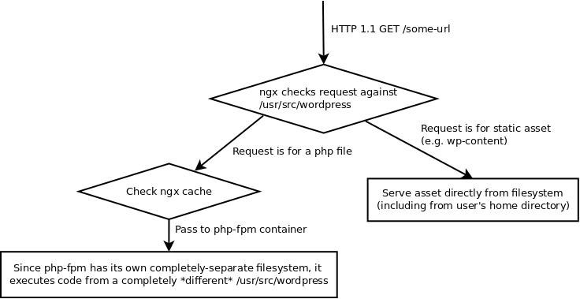

App Fleet
--------

### What is App Fleet?

App Fleet is a system for highly-streamlined site management in a shared-hosting environment. The idea is that where possible assets are loaded statically, directly from the filesystem. Executed code in legacy (i.e. php) apps can live in a group fpm container, or each site can have its own containerized fpm process and php containers are automatically shut down when not in use to conserve memory. Alongside this, vhosts are automatically generated when containers arrive and leave, and a full toolkit of ansible plays is provided to automate most common admin management tasks in a shared hosting environment.

It is perfectly suited for automation in a low-memory or resource-constrained environment.

### Why is it better than alternatives?

The design rationale here is to use Docker to assemble a Wordpress code directory from different parts of the host filesystem. That means that each user has their own wp-content directory but everyone uses a shared core lib. **Essentially, it gives us all of the advantages of WP:MU but none of the disadvantages.** The system has exactly one copy of Wordpress, which means only one copy of Wordpress core to worry about keeping up to date and virus free. And nginx and php see *slightly* different views of essentially the core code.

Let's see how that works in pratice. The host has a copy of Wordpress in /var/lib/wordpress, but code in that directory is **never** executed. Instead, it's only purpose is essentially to provide nginx with a white-list of web-executable files in a perfectly pristine condition. When a new request is received, nginx checks the request against the files in that directory.

 

In this scenario, the unused Wordpress core library in the host's filesystem functions as a kind of filesystem-based web application firewall, explicitly determining for Nginx what an allowable request looks like. Even if a malicious entity was able to compromise one of the fpm containers and install malicious code, that code would not be able to execute externally since it would never be part of the host's /usr/src/wordpress directory of allowed files. And in such a case, wiping the compromised site is as easy as shutting down the container and re-running it from a pristine Wordpress docker image.

#### How does it work?

See the `docs` directory for system architecture and trouble-shooting.

#### How do I use it?

You perform routine tasks with Ansible. See the `ansible` directory for playbooks and accompanying documentation. In general, you will find that ** every directory has its own README.md file, describing *exactly* what functions files in that directory perform and how to modify them.**

If you want to run it locally using Vagrant, please read `docs/installation and vagrant` next.

#### Documentation

** Every single directory ** in this repository should have an accompanying README.md file. The README.md file should contain an in-depth explanation for the purpose of * EVERY * file in that directory.

**User Documentation**

To begin, browse to the "ansible" directory.

**System Documentation**

To begin, browse to the "docs" directory for a high-level overview.

TODO
-----

	* Finish WP updates playbook
	* Ansible scripts should install and renew letsencrypt certs
	* DNS management
	* Import from Alba